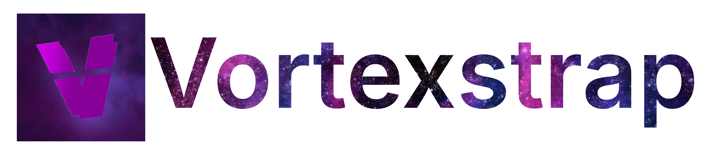
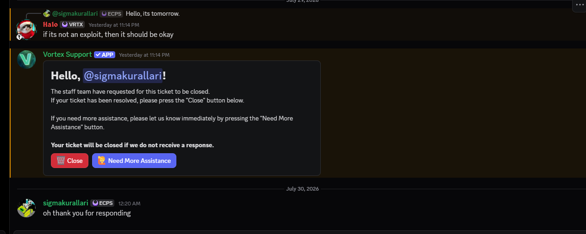

<p align="center">
  
</p>

# VortexStrap

> An alternative launcher for [Vortex](https://playvortex.io/) — a community-made Roblox-inspired game.

VortexStrap adds quality-of-life features on top of the default Vortex client, including custom font patching, animated cursors, render engine control, an in-game screenshot gallery, and old GPU support.

---

## Features

| Feature | Description |
|---|---|
| 🔤 **Font Patcher** | Replace Vortex's default Inter font with any TTF/OTF font you choose (binary-level patch) |
| 🖱️ **Custom Cursors** | Animated GIF or static cursor support inside the game |
| 🎮 **Render Engine Control** | Force DirectX 12, DirectX 11, Vulkan, or OpenGL backend via WGPU env vars |
| 🖥️ **Old GPU Support** | Software rendering fallback (CPU via WARP) for GPUs that don't meet minimum requirements |
| 📸 **Screenshot Gallery** | F12 hotkey captures in-game screenshots, viewable inside the launcher |
| 🎨 **Accent Color** | Customize the launcher's accent color |

---

## Requirements

- Windows 10 / 11
- Python 3.11+ (if running from source)
- [Vortex.exe](https://playvortex.io/) placed in the same folder

---

## Running from Source

1. Install dependencies:
```bash
pip install -r launcher/requirements.txt
```

2. Place `Vortex.exe` next to `Start_Launcher.bat`

3. Run the launcher:
```bash
Start_Launcher.bat
```
(requires Administrator for font patching)

---

## Building the EXE

```bash
pip install pyinstaller pillow
python build_exe.py
```

The output will be at `dist/VortexStrap/VortexStrap.exe`.

---

## Old GPU / Unsupported Graphics Card Fix

If you see **"Vortex could not find a graphics adapter that meets the minimum requirements"**:

1. Open VortexStrap
2. Go to the **Render & Graphics** tab
3. Check **"Software Rendering / CPU Fallback"**
4. Click **Save Render Settings**
5. Launch Vortex

This forces Vortex to use Windows' built-in **WARP (Microsoft Basic Render Driver)** software renderer on your CPU. Performance will be lower but the game will run.

---

## Is this Bannable?

> **Official Developer Response:**  
> *"If it's not an exploit, then it should be okay."* — **Halo** (Vortex Developer)

<p align="center">
  
</p>

VortexStrap only modifies local client settings (fonts, environment variables, cursors). It does **not** touch server-side logic, memory execution, or game physics, and is completely safe to use.

---

## Disclaimer

VortexStrap is an **unofficial community tool** and is not affiliated with the Vortex development team. It only modifies local launcher behavior (font files, environment variables) and does not exploit or alter the game's server-side logic.

---

## License

MIT

---

<p align="center">
  
</p>
